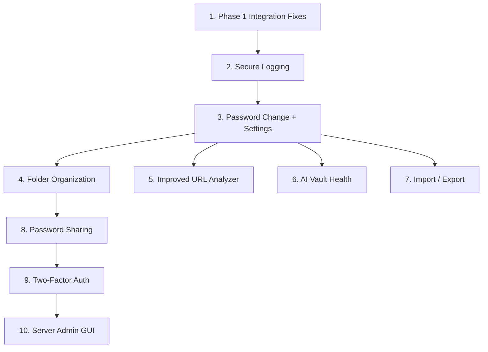

# SurfCrypt — Phase 2 Implementation Plan

> **Prerequisites:** Phase 1 complete (envelope encryption, vault CRUD, URL analyzer, GUI, session management)  
> **Goal:** Add features that elevate the project from a functional MVP to a polished, feature-rich application.

---

## Table of Contents

1. [Fix Phase 1 Integration Gaps](#1-fix-phase-1-integration-gaps)
2. [Secure Logging Framework](#2-secure-logging-framework)
3. [Password Sharing (Asymmetric Encryption)](#3-password-sharing-asymmetric-encryption)
4. [Two-Factor Authentication (TOTP)](#4-two-factor-authentication-totp)
5. [AI Vault Overview & Password Health](#5-ai-vault-overview--password-health)
6. [Improved URL Analyzer](#6-improved-url-analyzer)
7. [Folder Organization](#7-folder-organization)
8. [Import / Export](#8-import--export)
9. [Server Admin GUI](#9-server-admin-gui)
10. [Password Change & Settings Screen](#10-password-change--settings-screen)
11. [Schema Migration Strategy](#11-schema-migration-strategy)

---

## 1. Fix Phase 1 Integration Gaps

> **Priority: HIGH — Must complete before Phase 2 features**

Before adding new features, integrate the existing but disconnected Phase 1 components:

| Task | Effort |
|------|--------|
| Integrate URL handler methods into `SessionServer._dispatch()` | Small |
| Fix `gui_analyzer.py` import path and add to dashboard | Small |
| Add server-side `logout` action + client sends logout request | Small |
| Add `change_password` flow (server handler + identity method + GUI) | Medium |
| Add clipboard auto-clear (30s timer) | Trivial |
| Fix `create_url_analysis` unreachable code | Trivial |
| Add `malicious_domains.txt` sample file to resources | Small |
| Add plaintext fallback mode to `NetworkClient` | Small |

---

## 2. Secure Logging Framework

### Rationale

The codebase is full of commented-out `# logger.info(...)` stubs. Logging is essential for debugging and auditing but must **never leak sensitive information** (passwords, VaultKeys, session tokens, encrypted data). The goal is a framework that is:
- Detailed enough for a developer to trace any issue
- Safe enough that a client reading logs learns nothing about other users' secrets
- Compliant with the Master Plan's logging spec (rotation, levels, no sensitive data)

### Architecture

```
src/common/logging_config.py    ← New module; shared by client and server
```

**Two log targets:**

| Log | Location | Purpose | Content |
|-----|----------|---------|---------|
| **Server log** | `logs/server.log` | All server events | Requests, sessions, errors, DB operations |
| **Auth log** | `logs/auth.log` | Authentication events only | Register, login success/fail, logout, lockout |
| **Client log** | `logs/client.log` | Client-side errors | Network errors, decryption failures, UI exceptions |

### Implementation Details

```python
# logging_config.py

import logging
from logging.handlers import RotatingFileHandler

# Constants from Master Plan
MAX_LOG_SIZE_BYTES = 10 * 1024 * 1024  # 10 MB
BACKUP_COUNT = 5

# Scrubbing filter — strips known sensitive fields before writing
class SensitiveDataFilter(logging.Filter):
    """Remove/redact sensitive fields from log records.
    
    Scans formatted log messages for patterns that could leak secrets:
    - Session tokens → replaced with first 8 chars + '...'
    - auth_hash values → replaced with '[REDACTED]'
    - wrapped_vault_key, kek_salt, nonce values → replaced with '[REDACTED]'
    - Master passwords → never passed to logger in the first place
    """
    SENSITIVE_KEYS = ('auth_hash', 'wrapped_vault_key', 'kek_salt', 
                      'vault_key', 'nonce_wvk', 'password', 'master_password')
    
    def filter(self, record):
        msg = record.getMessage()
        for key in self.SENSITIVE_KEYS:
            if key in msg:
                # Replace value patterns after the key
                record.msg = self._redact(record.msg, key)
        return True
```

**Key design decisions:**
- Use `RotatingFileHandler` with max 10MB per file, keep 5 backups (per Master Plan)
- `SensitiveDataFilter` applied to all handlers — **defense in depth** even if a developer accidentally logs a sensitive value
- Session tokens logged as truncated hashes: `token=a1b2c3d4...` (enough to correlate, not enough to hijack)
- All log calls use the module's logger (`logging.getLogger(__name__)`) for proper hierarchy
- Client logs are **local only** — never sent to server

### Affected Files

All files with `# logger.info(...)` stubs: `database.py`, `server.py`, `network.py`, `identity.py`

### Open Questions

> [!IMPORTANT]
> **Q1:** Should client-side logs be enabled by default or opt-in (e.g., a `--debug` flag)? Default-on is useful for school submissions but may concern privacy-conscious users.

> **Q2:** Should log files be encrypted at rest, or is file-system ACLs sufficient for the lab environment?

---

## 3. Password Sharing (Asymmetric Encryption)

### Rationale

Users need to securely share individual credentials with trusted users. This requires asymmetric encryption so that only the intended recipient can decrypt the shared secret.

### Cryptographic Design

```
Sender (Alice)                                         Recipient (Bob)
                                                       
1. Alice decrypts her VaultKey                        
2. Alice decrypts the secret she wants to share        
3. Alice fetches Bob's PUBLIC key from the server      
                                                       
4. shared_key = nacl.public.Box(                       
       Alice_private_key,                              
       Bob_public_key                                  
   )                                                   
5. encrypted_share = shared_key.encrypt(               
       plaintext_secret_fields                         
   )                                                   
6. Send encrypted_share to server                      
                                                       7. Bob fetches shared secrets list
                                                       8. Bob decrypts using:
                                                          nacl.public.Box(
                                                              Bob_private_key,
                                                              Alice_public_key
                                                          )
```

**Key pair generation (at registration or on first share):**
```python
# Generate X25519 keypair
private_key = nacl.public.PrivateKey.generate()
public_key  = private_key.public_key

# Wrap private key with VaultKey (same envelope approach!)
wrapped_private_key, nonce_pk = encrypt_field(
    private_key.encode(), vault_key
)

# Store public_key (plaintext) + wrapped_private_key in users table
```

> [!NOTE]
> **Why not derive keys from master password?** Same reason as VaultKey — derived keys change when password changes. A random keypair wrapped with VaultKey is stable across password changes.

### Schema Changes

```sql
-- Add to users table
ALTER TABLE users ADD COLUMN public_key BLOB;           -- X25519 public key (32 bytes, plaintext)
ALTER TABLE users ADD COLUMN wrapped_private_key BLOB;   -- Encrypted private key
ALTER TABLE users ADD COLUMN nonce_private_key BLOB;     -- Nonce for private key wrapping

-- New table
CREATE TABLE IF NOT EXISTS shared_secrets (
    id INTEGER PRIMARY KEY AUTOINCREMENT,
    secret_id INTEGER NOT NULL,              -- Reference to original secret
    owner_id INTEGER NOT NULL,               -- User who shared it
    recipient_id INTEGER NOT NULL,           -- User who receives it
    
    -- Re-encrypted fields using NaCl Box (sender_priv + recipient_pub)
    name_encrypted BLOB NOT NULL,
    url_encrypted BLOB NOT NULL,
    username_encrypted BLOB NOT NULL,
    password_encrypted BLOB NOT NULL,
    notes_encrypted BLOB NOT NULL,
    nonce_share BLOB NOT NULL,               -- Single nonce for Box encryption
    
    shared_at DATETIME DEFAULT CURRENT_TIMESTAMP,
    
    FOREIGN KEY (secret_id) REFERENCES secrets(id) ON DELETE CASCADE,
    FOREIGN KEY (owner_id) REFERENCES users(id) ON DELETE CASCADE,
    FOREIGN KEY (recipient_id) REFERENCES users(id) ON DELETE CASCADE
);
```

### New Server Actions

| Action | Auth Required | Description |
|--------|:---:|-------------|
| `generate_keypair` | ✅ | Store public key + wrapped private key for the user |
| `get_public_key` | ✅ | Fetch another user's public key by username |
| `share_secret` | ✅ | Store re-encrypted secret in `shared_secrets` |
| `get_shared_secrets` | ✅ | Fetch all secrets shared *with* the authenticated user |
| `revoke_share` | ✅ | Owner removes a share (deletes row from `shared_secrets`) |
| `search_users` | ✅ | Search for usernames (for share target discovery) |

### GUI Changes

- **Share button** on secret detail (opens a dialog to search for recipient username)
- **"Shared With Me" tab** on dashboard showing received shares (read-only)
- **Share indicators** (icon/badge) on secrets that have been shared with others
- **Revoke button** accessible from context menu on shared secrets

### Open Questions

> [!IMPORTANT]
> **Q3:** Should sharing encrypt all 5 fields into a single NaCl Box message, or encrypt each field separately (like the vault does)? 
>
> - **Single box**: Simpler, one nonce per share. The recipient decrypts one blob and parses the JSON.
> - **Per-field**: Consistent with vault model but more complex and 5x more columns in `shared_secrets`.
>
> **My suggestion:** Single box with a JSON payload containing all fields. Simpler schema, fewer nonces to manage, and shared secrets are read-only so there's no need for per-field updates.

> **Q4:** Should shared secrets auto-update when the owner modifies the original? Or is it a point-in-time snapshot?
>
> - **Live sync** requires re-encrypting the share every time the owner edits — complex.
> - **Snapshot** is simpler and more secure (owner explicitly controls what's shared).
>
> **My suggestion:** Snapshot model. Owner can re-share after editing to push an update.

---

## 4. Two-Factor Authentication (TOTP)

### Rationale

TOTP (Time-based One-Time Password, RFC 6238) adds a second factor to login. Even if a master password is compromised, an attacker cannot log in without the TOTP code.

### Architecture

```
Registration of 2FA:
1. Server generates a random TOTP secret (20 bytes)
2. Server returns the secret as a provisioning URI (otpauth://...)
3. Client displays QR code for scanning with authenticator app
4. User enters verification code to confirm setup
5. Server stores TOTP secret encrypted in users table

Login with 2FA:
1. Normal login flow completes (auth_hash verified)
2. Server checks if user has 2FA enabled
3. If yes: server returns "2fa_required" instead of session token
4. Client prompts for TOTP code
5. Client sends code to server
6. Server verifies code with ±1 time step tolerance
7. On success: server issues session token as normal
```

### Dependencies

```
pyotp==2.9.0       # TOTP implementation (RFC 6238)
qrcode==7.4.2      # QR code generation for provisioning URI
Pillow              # Image rendering for QR in Tkinter
```

### Schema Changes

```sql
ALTER TABLE users ADD COLUMN totp_secret_encrypted BLOB;  -- Encrypted with VaultKey
ALTER TABLE users ADD COLUMN totp_nonce BLOB;              -- Nonce for above
ALTER TABLE users ADD COLUMN totp_enabled BOOLEAN DEFAULT 0;
```

> [!NOTE]
> **Security:** The TOTP secret is encrypted at rest with the server's own key (since the server must verify codes). This is **not** zero-knowledge for the 2FA secret — the server necessarily knows it. This is standard (Google, Microsoft, etc. all store TOTP seeds server-side).

### New Server Actions

| Action | Description |
|--------|-------------|
| `setup_2fa` | Generate TOTP secret, return provisioning URI |
| `verify_2fa_setup` | Confirm initial code, enable 2FA |
| `verify_2fa_login` | Verify code during login, return session token |
| `disable_2fa` | Require current TOTP code + password to disable |

### Open Questions

> [!IMPORTANT]
> **Q5:** How to handle 2FA recovery if the user loses their authenticator app?
>
> Options:
> - **Recovery codes** (generate 10 single-use codes at setup time, stored encrypted)
> - **Admin reset** (server admin can disable 2FA for a user)
> - **Both** (recovery codes + admin escape hatch)
>
> **My suggestion:** Both. Recovery codes are standard practice; admin reset is needed for a school environment.

> **Q6:** The TOTP secret must be stored server-side for verification. Should it be stored in plaintext, or encrypted with a server-managed key?
>
> **My suggestion:** Encrypt with a server-managed key (loaded from env var or config). This way a raw DB dump doesn't expose TOTP seeds.

---

## 5. AI Vault Overview & Password Health

### Rationale

Provide users with an intelligent overview of their vault's security posture: reused passwords, weak passwords, old passwords, and breach detection.

### Architecture — Fully Client-Side

```
Client retrieves all secrets → decrypts locally → runs analysis locally
                                                         ↓
                                            ┌────────────────────────┐
                                            │  Password Health Panel │
                                            │                        │
                                            │  ✖ 3 reused passwords  │
                                            │  ⚠ 2 weak passwords    │
                                            │  ⚠ 5 passwords > 90d   │
                                            │  ✔ 12 strong passwords  │
                                            │                        │
                                            │  Overall: 72/100       │
                                            └────────────────────────┘
```

> [!NOTE]
> **Privacy:** ALL analysis happens client-side. No password data is sent anywhere — not to the server, not to any API. The decrypted passwords exist only in client memory during analysis.

### Analysis Components

**1. Password Strength Scoring (local):**
- Entropy calculation based on character set diversity and length
- Penalty for common patterns (dictionary words, keyboard walks, sequential numbers)
- Uses a small bundled wordlist (~10K common passwords) for dictionary check

**2. Reuse Detection (local):**
- Hash each decrypted password → compare hashes
- Report groups of secrets sharing the same password
- Flag: "Gmail and Twitter use the same password"

**3. Password Age Tracking:**
- Use `created_at` / `updated_at` timestamps from secrets
- Flag passwords older than configurable threshold (default: 90 days)

**4. Breach Detection (optional, network):**
- Use [HaveIBeenPwned k-Anonymity API](https://haveibeenpwned.com/API/v3#SearchingPwnedPasswordsByRange)
- Hash password with SHA-1, send only first 5 characters of hash to API
- API returns all matching hash suffixes → client checks locally
- **Privacy preserved:** Full password hash never leaves client

**5. "AI Overview" Summary Panel:**

> [!IMPORTANT]
> **Q7:** By "AI overview," do you mean:
> - **(A)** A local heuristic scoring engine that summarizes vault health with rules-based analysis (no actual ML model)? This is deterministic and doesn't require any external API.
> - **(B)** An actual LLM integration (e.g., local Ollama model or cloud API) that generates natural-language recommendations?
> - **(C)** A hybrid: heuristic scoring + an optional LLM call for natural-language summary?
>
> **My suggestion:** Option (A) for the graded submission — it's fully self-contained, no API keys needed, no privacy concerns. Label it as "AI-powered analysis" in the UI (heuristic analysis is a form of AI). Option (B) or (C) can be added later as an enhancement toggle.

### GUI Changes

- **"Vault Health" button** on dashboard top bar
- **Health Panel** (modal or side panel) showing:
  - Overall security score (0–100)
  - Categorized findings with severity icons
  - Click-to-navigate: clicking a finding highlights the relevant secret
  - "Check for Breaches" button (opt-in, for HIBP)

### New Files

```
src/client/vault_health.py     ← Analysis engine (strength, reuse, age, HIBP)
src/client/gui_health.py       ← Tkinter Health panel
resources/common_passwords.txt ← Bundled wordlist for dictionary check
```

---

## 6. Improved URL Analyzer

### Current State

Phase 1 analyzer is offline-only: format validation, shortener detection, blacklist lookup, IP/subdomain heuristics.

### Phase 2 Additions

| Feature | Description | Implementation |
|---------|-------------|----------------|
| **VirusTotal API** | Query VT for URL reputation | HTTP GET to `/api/v3/urls/{id}` with API key |
| **HTTP Header Inspection** | Check for missing security headers | `requests.head()` → check `X-Frame-Options`, `CSP`, `HSTS`, etc. |
| **Redirect Chain Following** | Follow up to 10 redirects, log each hop | `requests.get(allow_redirects=False)` in a loop |
| **SSL Certificate Info** | Check cert validity, issuer, expiry | `ssl.get_server_certificate()` + `x509` parsing |
| **Download Trigger Detection** | Check `Content-Disposition` and `Content-Type` for file downloads | Inspect response headers from HEAD request |
| **Enhanced Blacklist** | Larger bundled list + periodic update check | Ship a larger `malicious_domains.txt` with update mechanism |

### Architecture

```python
# Enhanced analyzer.py structure

class UrlAnalyzer:
    """Phase 2: Multi-source URL analyzer"""
    
    def analyze(self, url, deep=False):
        """
        Run analysis. When deep=True, perform network-based checks
        (VirusTotal, headers, redirects, SSL). When deep=False,
        run only offline heuristics (Phase 1 behavior).
        """
        result = self._offline_checks(url)
        
        if deep:
            result['headers'] = self._check_headers(url)
            result['redirects'] = self._follow_redirects(url)
            result['ssl_info'] = self._check_ssl(url)
            result['virustotal'] = self._query_virustotal(url)
            result['download_triggers'] = self._check_downloads(url)
            
            # Recalculate rating with additional signals
            result['rating'] = self._compute_deep_rating(result)
        
        return result
```

### GUI Changes

- **"Deep Scan" toggle** next to the Analyze button
- **Advanced details panel** (collapsible) showing:
  - HTTP headers table
  - Redirect chain visualization
  - SSL certificate summary
  - VirusTotal scan results
  - Download trigger warnings

### Configuration

```ini
# client config
[APIs]
virustotal_key = ${VIRUSTOTAL_API_KEY}  # Optional; deep scan works without it (skips VT)
```

### Open Questions

> **Q8:** VirusTotal free tier is limited to 4 requests/minute. Should the analyzer:
> - **(A)** Queue requests and rate-limit automatically?
> - **(B)** Show "VT unavailable" if rate-limited?
> - **(C)** Skip VT by default and only use it when explicitly toggled?
>
> **My suggestion:** (C) — VT is opt-in. Deep scan without VT still adds headers, redirects, SSL, and download detection.

---

## 7. Folder Organization

### Complexity Assessment

> [!NOTE]
> **TL;DR: Low effort without drag-and-drop. Include it.**
>
> The existing `ttk.Treeview` already supports hierarchical parent-child insertion natively — `tree.insert(parent_iid, ...)` is built-in. The hard work (rendering a tree, expanding/collapsing nodes) is free.
>
> **What keeps this low-effort:**
> - No drag-and-drop (Tkinter's Treeview has no built-in DnD; implementing it requires custom mouse event hacking — skip it, use right-click "Move to Folder" instead)
> - No encrypted folder names (see rationale below)
> - Client already decrypts everything locally, so tree-building logic is a simple loop
> - Server needs only 5 new actions (all straightforward CRUD)
>
> **Effort estimate: 1–2 days** (down from 2–3 in the original estimate)

### Design Decision: Unencrypted Folder Names

The original plan called for encrypting folder names (zero-knowledge model). On reflection, **skip this for now**:

- Folder names are organizational metadata, not secrets ("Work", "Banking", "Social Media")
- Encrypting folder names requires the server to return blobs that the client decrypts before displaying — adding a full crypto round-trip just to render the sidebar
- The actual secrets (passwords, usernames, URLs) are still encrypted; folder names reveal structure but no credentials
- This matches how most commercial password managers handle it (Bitwarden stores folder names in plaintext server-side)

If zero-knowledge folder names become a requirement in Phase 3, it's a straightforward upgrade: just wrap the name field with `encrypt_field`.

### Schema

```sql
-- One new table
CREATE TABLE IF NOT EXISTS folders (
    id         INTEGER  PRIMARY KEY AUTOINCREMENT,
    user_id    INTEGER  NOT NULL,
    name       TEXT     NOT NULL,        -- plaintext (see decision above)
    parent_id  INTEGER,                  -- NULL = root-level folder
    created_at DATETIME DEFAULT CURRENT_TIMESTAMP,

    FOREIGN KEY (user_id)   REFERENCES users(id)   ON DELETE CASCADE,
    FOREIGN KEY (parent_id) REFERENCES folders(id)  ON DELETE SET NULL
    -- SET NULL so deleting a parent doesn't cascade-delete its children
);

-- One new column on secrets
ALTER TABLE secrets ADD COLUMN folder_id INTEGER REFERENCES folders(id) ON DELETE SET NULL;
-- ON DELETE SET NULL: if a folder is deleted, its secrets move to root (no folder)
```

**Default state:** No "root folder" row is needed. `folder_id = NULL` means "in root / no folder". The client renders a synthetic "All Secrets" root node for items where `folder_id IS NULL`.

### New Server Actions

| Action | Request payload | Description |
|--------|-----------------|-------------|
| `sync_folders` | _(none)_ | Return all folders for the authenticated user |
| `create_folder` | `{name, parent_id}` | Insert new folder row; return `folder_id` |
| `rename_folder` | `{folder_id, new_name}` | Update name; verify ownership first |
| `delete_folder` | `{folder_id}` | Delete folder; secrets and sub-folders get `folder_id = NULL` |
| `move_secret` | `{secret_id, folder_id}` | Update `folder_id` on a secret; verify secret ownership |

All five are simple ownership-verified DB writes — no crypto involved.

### New Database Methods

```python
# database.py additions

def create_folder(self, user_id, name, parent_id=None) -> int:
    """Insert folder row; return folder_id"""

def get_folders_by_user(self, user_id) -> list[dict]:
    """Return all folder rows for user (id, name, parent_id, created_at)"""

def rename_folder(self, folder_id, new_name) -> bool:
    """Update folder name; return True if row updated"""

def delete_folder(self, folder_id) -> bool:
    """Delete folder; FK SET NULL handles children"""

def get_folder_owner(self, folder_id) -> int | None:
    """Return user_id for a folder (for ownership checks)"""

def move_secret_to_folder(self, secret_id, folder_id) -> bool:
    """Update secrets.folder_id; folder_id=None means root"""
```

### `sync_secrets` Response Change

Add `folder_id` to the existing `sync_secrets` response (currently returns secrets without folder info):

```python
# In _handle_sync_secrets, add to each encoded secret:
'folder_id': secret['folder_id'],  # int or None
```

### GUI Changes

#### Layout Change: Split Dashboard Pane

Replace the current single-panel layout with a two-column layout:

```
┌──────────────────────────────────────────────────────────┐
│  [Refresh]  [Add Secret]  [Analyze URL]      [Logout]    │  ← top bar (unchanged)
├────────────────┬─────────────────────────────────────────┤
│  📁 All        │  Name          URL             Username  │
│  📁 Work  ▸   │  Gmail         gmail.com       user@...  │
│  📁 Banking    │  GitHub        github.com      user@...  │
│    📁 Cards  ▸ │  Netflix       netflix.com     user@...  │
│  📁 Personal   │                                          │
│                │                                          │
├────────────────┴─────────────────────────────────────────┤
│  [Edit] [Delete] [Copy Username] [Copy Password]  status │  ← action bar (unchanged)
└──────────────────────────────────────────────────────────┘
```

The **left panel** is a separate, narrow `ttk.Treeview` (no columns, just names) used as a folder sidebar. The **right panel** is the existing secrets `ttk.Treeview` (unchanged). Selecting a folder on the left filters the secrets shown on the right.

#### Left Sidebar: Folder Tree

```python
# Inside DashboardFrame._build_treeview(), split into two panels:

paned = ttk.PanedWindow(self, orient='horizontal')
paned.grid(row=1, column=0, sticky='nsew', padx=8, pady=4)

# Left: folder sidebar
folder_frame = ttk.Frame(paned, width=160)
self.folder_tree = ttk.Treeview(folder_frame, show='tree', selectmode='browse')
self.folder_tree.pack(fill='both', expand=True)
self.folder_tree.bind('<<TreeviewSelect>>', self._on_folder_select)
self.folder_tree.bind('<Button-3>', self._on_folder_right_click)

# Right: secrets list (existing tree, moved inside paned)
secrets_frame = ttk.Frame(paned)
self.tree = ttk.Treeview(secrets_frame, columns=self._COLUMNS, show='headings', ...)
# ... rest of existing treeview setup
```

#### Folder Sidebar Context Menu

Right-click on a folder → menu with:
- **New Subfolder** — prompt for name, `create_folder(parent_id=selected_folder_id)`
- **Rename** — inline edit prompt, `rename_folder()`
- **Delete** — confirm dialog (warn: secrets move to root), `delete_folder()`

Right-click on "All Secrets" (root) → only **New Folder** option.

#### Secrets Context Menu Addition

Add to the existing right-click menu on secrets:
- **Move to Folder →** submenu listing all folders (flat list with indentation for depth)

No drag-and-drop. The submenu approach is clean and avoids the custom mouse event complexity entirely.

#### `refresh_vault()` Refactor

```python
def refresh_vault(self):
    """Fetch folders + secrets, build sidebar tree, filter secrets pane by selection"""
    im = self.controller.identity_manager

    # 1. Fetch folders
    folder_response = self.controller.network_client.send_request('sync_folders', {}, im.session_token)
    folders = folder_response.get('data', {}).get('folders', [])

    # 2. Fetch secrets (existing logic)
    secret_response = self.controller.network_client.send_request('sync_secrets', {}, im.session_token)
    rows = secret_response.get('data', {}).get('secrets', [])

    # 3. Build folder sidebar tree
    self._rebuild_folder_tree(folders)

    # 4. Build decrypted_secrets cache (existing logic)
    self._rebuild_secrets_cache(rows, im.vault_key)

    # 5. Display secrets filtered by current folder selection (default: All)
    self._apply_folder_filter()

def _rebuild_folder_tree(self, folders):
    """Clear and repopulate the folder sidebar from flat folder list"""
    for iid in self.folder_tree.get_children():
        self.folder_tree.delete(iid)

    # Insert synthetic root
    self.folder_tree.insert('', 'end', iid='__all__', text='All Secrets', open=True)

    # Build id→row lookup and insert children after parents
    folder_map = {f['id']: f for f in folders}
    inserted = set()

    def insert_folder(f):
        if f['id'] in inserted:
            return
        parent_iid = '__all__'
        if f['parent_id'] and f['parent_id'] in folder_map:
            insert_folder(folder_map[f['parent_id']])  # ensure parent exists first
            parent_iid = str(f['parent_id'])
        self.folder_tree.insert(parent_iid, 'end', iid=str(f['id']), text=f['name'], open=True)
        inserted.add(f['id'])

    for f in folders:
        insert_folder(f)

    # Select "All Secrets" by default
    self.folder_tree.selection_set('__all__')

def _apply_folder_filter(self):
    """Show only secrets matching the selected folder (or all if root selected)"""
    sel = self.folder_tree.selection()
    selected_iid = sel[0] if sel else '__all__'

    for iid in self.tree.get_children():
        self.tree.delete(iid)

    for secret_id, plaintext in self.decrypted_secrets.items():
        folder_id = self._secret_folder_ids.get(secret_id)  # None = root
        if selected_iid == '__all__':
            show = True
        elif selected_iid == '__root__':
            show = folder_id is None
        else:
            show = str(folder_id) == selected_iid
        if show:
            self.tree.insert('', 'end', iid=secret_id,
                             values=(plaintext['name'], plaintext['url'], plaintext['username']))
```

### New State in DashboardFrame

```python
# In __init__:
self._secret_folder_ids = {}   # {secret_id_str: folder_id_int_or_None}
self._folders = {}              # {folder_id: {'name': ..., 'parent_id': ...}}
```

`_secret_folder_ids` is populated alongside `decrypted_secrets` in `_rebuild_secrets_cache()` — just read `row['folder_id']` from the sync_secrets response.

### Summary of Files Changed

| File | Change |
|------|--------|
| `schema.sql` | New `folders` table + `folder_id` column on `secrets` |
| `database.py` | 5 new methods (create/get/rename/delete folder, move_secret) |
| `server.py` | 5 new dispatch routes + handler methods |
| `gui.py` | Split treeview into paned window, folder sidebar, refactor `refresh_vault`, new context menu entries |


## 8. Import / Export

### Export (Encrypted Backup)

```python
def export_vault(vault_key, secrets, output_path):
    """
    Export all decrypted secrets to an encrypted JSON file.
    
    Format:
    {
        "version": 1,
        "exported_at": "2026-04-26T14:00:00Z",
        "secrets": [ { "name": "...", "url": "...", ... }, ... ]
    }
    
    The entire JSON is then encrypted with VaultKey and written as a binary file.
    """
```

### Import

- Accept: encrypted SurfCrypt backup, CSV (plain), JSON (plain)
- CSV/JSON import: re-encrypt each field with VaultKey before saving
- SurfCrypt backup: decrypt with VaultKey, re-encrypt, save

### Open Questions

> **Q9:** Should CSV/JSON import support the formats of other password managers (e.g., Chrome export, Bitwarden export)?
>
> **My suggestion:** Support Chrome CSV format (most common) + generic CSV with column mapping dialog.

---

## 9. Server Admin GUI

### Architecture

A separate Tkinter window (or PyQt6 if you prefer) launched by the server process.

### Features

| Feature | Description |
|---------|-------------|
| Start/Stop server button | Toggle `start_server()` / `stop_server()` |
| Active sessions list | Real-time view of active sessions (username, connected since, expiry) |
| Connection log | Scrolling text view of recent connections and actions |
| Basic stats | Total users, total secrets, total URL analyses |
| User management | List users, force-logout, disable 2FA (admin recovery) |

### Implementation

```python
# src/server/server_gui.py

class ServerAdminGUI:
    """Tkinter admin panel for server monitoring"""
    
    def __init__(self, server: SessionServer):
        self.server = server
        self.root = tk.Tk()
        self.root.title("SurfCrypt Server Admin")
        # ... build UI
    
    def _refresh_sessions(self):
        """Poll active sessions from DB every 5 seconds"""
        sessions = self.server.db.get_active_sessions()
        # Update treeview
        self.root.after(5000, self._refresh_sessions)
```

---

## 10. Password Change & Settings Screen

### Password Change Flow

Already described in Master Plan. Implementation:

1. **GUI:** Settings screen with "Change Password" section (old password, new password, confirm)
2. **Client:** `IdentityManager.change_password(old_pw, new_pw)`:
   - Derive old KEK → unwrap VaultKey
   - Generate new kek_salt, auth_salt
   - Derive new KEK, new auth_hash
   - Re-wrap VaultKey with new KEK
   - Send new auth material to server
3. **Server:** `_handle_change_password(data, user_id)`:
   - Verify old auth_hash (prevent unauthorized changes)
   - Update user credentials via `update_user_credentials()`
   - Invalidate all existing sessions

### Settings Screen Features

| Feature | Description |
|---------|-------------|
| Change master password | Full re-key flow |
| Enable/disable 2FA | With verification |
| Generate sharing keypair | One-time setup |
| Dark/light mode toggle | Theme persistence |
| Session timeout display | Read-only, shows 15min |
| About section | Version, description |

---

## 11. Schema Migration Strategy

Since SQLite doesn't support full `ALTER TABLE`, and Phase 1 databases already exist:

```python
# src/server/database/migrations.py

MIGRATIONS = [
    # Migration 1: Add sharing columns to users
    """ALTER TABLE users ADD COLUMN public_key BLOB;""",
    """ALTER TABLE users ADD COLUMN wrapped_private_key BLOB;""",
    """ALTER TABLE users ADD COLUMN nonce_private_key BLOB;""",
    
    # Migration 2: Add 2FA columns to users  
    """ALTER TABLE users ADD COLUMN totp_secret_encrypted BLOB;""",
    """ALTER TABLE users ADD COLUMN totp_nonce BLOB;""",
    """ALTER TABLE users ADD COLUMN totp_enabled BOOLEAN DEFAULT 0;""",
    
    # Migration 3: Create folders table + add folder_id to secrets
    """CREATE TABLE IF NOT EXISTS folders (...);""",
    """ALTER TABLE secrets ADD COLUMN folder_id INTEGER REFERENCES folders(id) ON DELETE SET NULL;""",
    
    # Migration 4: Create shared_secrets table
    """CREATE TABLE IF NOT EXISTS shared_secrets (...);""",
    
    # Migration 5: Create schema_version tracking table
    """CREATE TABLE IF NOT EXISTS schema_version (version INTEGER NOT NULL);""",
]

def run_migrations(db_manager):
    """Apply pending migrations based on current schema version"""
    current = get_current_version(db_manager)
    for i, migration in enumerate(MIGRATIONS):
        if i >= current:
            db_manager.conn.executescript(migration)
    set_version(db_manager, len(MIGRATIONS))
```

---

## Implementation Order

Suggested priority (each builds on the previous):



| Stage | Features | Estimated Effort |
|-------|----------|:---:|
| 1 | Phase 1 fixes + Logging | 1–2 days |
| 2 | Password change + Settings screen | 1–2 days |
| 3 | Folder organization | 1–2 days |
| 4 | Improved URL analyzer | 2–3 days |
| 5 | AI vault health | 2–3 days |
| 6 | Import / Export | 1–2 days |
| 7 | Password sharing | 3–4 days |
| 8 | Two-factor auth | 2–3 days |
| 9 | Server admin GUI | 1–2 days |

---

## Summary of Open Questions

| # | Question | My Suggestion |
|---|----------|---------------|
| Q1 | Client logging default on or opt-in? | Default on for school submission |
| Q2 | Encrypt log files at rest? | No — ACLs sufficient for lab |
| Q3 | Share as single Box message or per-field? | Single Box with JSON payload |
| Q4 | Shared secrets live-sync or snapshot? | Snapshot (simpler, more secure) |
| Q5 | 2FA recovery: codes, admin reset, or both? | Both |
| Q6 | TOTP secret stored plaintext or encrypted? | Encrypted with server key |
| Q7 | "AI overview" — heuristic, LLM, or hybrid? | Heuristic (option A) for graded submission |
| Q8 | VirusTotal rate limiting strategy? | Opt-in only, skip when unavailable |
| Q9 | Import formats beyond SurfCrypt backup? | Chrome CSV + generic CSV mapping |
